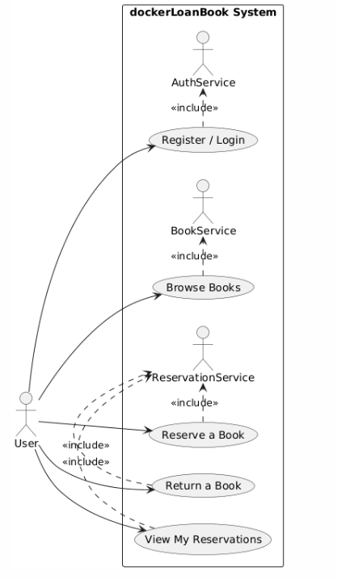

# dockerLoanBook

**dockerLoanBook** is a microservices-based application for managing book loans.
It is built with **Spring Boot 3.3.1**, **Java 17**, and **Maven**, containerized with **Docker**, and orchestrated with **Docker Compose**.

The project demonstrates a clean microservice architecture with authentication, book management, and reservations, all tied together with a frontend served via **Thymeleaf** and proxied by **NGINX**.

---

## Architecture

The application is composed of **4 microservices**:

* **AuthService** – Handles authentication & user management (basic auth, no Spring Security).
* **BookService** – Manages books (add, update, list, search).
* **ReservationService** – Handles reservations (loan requests, returns, tracking).
* **FrontendService** – Thymeleaf-based UI for user interaction.

Additional components:

* **MariaDB** – Shared database container.
* **Maven Builder** – Builds & tests services in a container.
* **ConfigService**  – Centralized configuration with Spring Cloud Config.
* **NGINX** – Reverse proxy & API gateway.

---

## Project Structure

```
dockerLoanBook/
│── AuthService/         # Authentication microservice
│── BookService/         # Book management microservice
│── ReservationService/  # Reservation/loan microservice
│── FrontendService/     # Thymeleaf UI
│── ConfigService/       # Spring Cloud Config Server
│── nginx/               # NGINX reverse proxy config
│── docker-compose.yml   # Orchestration file
```

---

## Testing

* Each microservice includes **unit and integration tests**.
* Tests run inside the `maven-builder` container.
* A dedicated `mariadb-test` container is used for isolated test databases.

---

## Running the Application

### 1. Pull required base images

Make sure you have the following images locally:

* `maven:3.9.2-eclipse-temurin-17`
* `mariadb:latest`

### 2. Start databases

```bash
docker-compose up mariadb-test mariadb --build -d
```

### 3. Build & run tests

```bash
docker-compose up maven-builder --build -d
```

-> Check the logs for build/test results.

### 4. Start microservices & gateway

```bash
docker-compose up authservice frontendservice reservationservice bookservice nginx --build -d
```

---

## Access

* Open the application in **Mozilla Firefox** (recommended).

  > If CSS does not load, clear browser cache and retry.
* Entry point: `http://localhost:80` (proxied through NGINX).

---

## Purpose

This project was built as a **CIA (Continuous Integration Assessment)**, focusing on:

* Microservice architecture
* Containerization with Docker
* Centralized configuration (Spring Cloud Config)
* Reverse proxying with NGINX
* Automated builds & tests with containerized Maven

Code is **not production-ready** — the goal is **architecture & orchestration**.

---

## Technologies

* **Java 17**
* **Spring Boot 3.3.1**
* **Spring Cloud Config**
* **MariaDB**
* **Docker / Docker Compose**
* **NGINX**
* **Thymeleaf**

---

## UML Use Case Diagram

